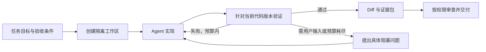

# AgentFlow 项目审查与升级建议

审查日期：2026-09-05。基于当前工作区（包含原有未提交改动），Git HEAD 为 `f2bb383`。

**建议把 AgentFlow 升级为“面向任务交付的本地开发控制台”：复用 Codex / Claude 的执行能力，把自己的重心放在任务状态、隔离工作区、验证证据、审查交付和跨工具协作。**

已有的 DAG、三层状态、项目配置、Diff Review 和 SQLite 都值得保留。需要调整的是默认工作方式和执行闭环：让日常任务直接进入实现与验证；复杂任务再展开计划、并行和独立审查。不要继续以角色数量、流程节点数量或自动审批比例衡量进步。

## 1. 审查范围与验证结果

检查了项目说明、架构和 L2 方案，后端服务与路由中的核心执行链，前端 API、状态同步和主要页面结构，SQLite 映射、Git/同步逻辑、测试和 Docker/CI 配置。

| 检查 | 结果 | 边界 |
| --- | --- | --- |
| 前后端构建 `yarn build` | 通过 | 证明可编译和打包 |
| `yarn lint` | 0 errors，7 warnings | 多项规则已关闭，不能等同于严格质量门禁 |
| 后端测试 | 10 个文件、136 项全部通过 | 首次有一个监听端口测试被沙箱阻止；取得权限后重跑通过 |
| 针对性运行探针 | 复现了条件分支、无测试证据放行、评分边界及 SQLite 字段丢失 | 使用编译产物和内存数据库，不调用真实 Agent |
| Codex / Claude 实际端到端交付 | 未执行 | 未消耗模型额度、未让 Agent 修改真实项目 |
| Docker 运行、浏览器全流程、跨设备同步 | 未实测 | 相关结论为源码或配置审查 |

没有读取 `.env` 中的凭据，没有修改原有业务代码，没有提交或推送。本报告是审查与实施建议，不表示以下问题已经修复。

## 2. 需要优先处理的实现问题

优先级含义：P1 应在扩大自动执行范围前解决；P2 是随后需要处理的可靠性与维护问题。以下区分已复现与静态分析。

### P1：工作区隔离未接入实际执行链

证据：[自动启动](/Users/pengshujian/Desktop/AISpecCoding/agent-flow/packages/server/src/index.ts:307)、[手动执行路由](/Users/pengshujian/Desktop/AISpecCoding/agent-flow/packages/server/src/routes/agents.ts:21)、[工作区创建服务](/Users/pengshujian/Desktop/AISpecCoding/agent-flow/packages/server/src/services/repo-isolation.ts:127)。

自动启动取 `project.path` 作为 cwd；手动启动同样使用项目路径。全仓库搜索 `createWorkspace(` 只找到服务方法定义，没有执行链调用。Diff Review 又依赖按 turnId 获取工作区，没有工作区就返回 null。

影响：并行 Agent 可以写同一个工作目录；分支隔离与 Diff Review 的实现存在，但普通执行没有形成闭环。`cwd` 也不限制进程访问其他目录。

建议：统一所有启动入口为一个 ExecutionService，在启动前分配 workspace，固定 base SHA 并持久化。重试复用同一任务工作区；真正并行的写任务才分配独立 worktree。失败必须显式阻断，不能静默降级成共享目录。

### P1：权限策略没有执行约束，且 Codex 默认使用完全访问模式

证据：[进程环境](/Users/pengshujian/Desktop/AISpecCoding/agent-flow/packages/server/src/services/agent.ts:695)、[Codex 参数](/Users/pengshujian/Desktop/AISpecCoding/agent-flow/packages/server/src/services/agent.ts:1667)、[权限策略](/Users/pengshujian/Desktop/AISpecCoding/agent-flow/packages/server/src/services/permission-isolation.ts:116)。

`buildArgs` 固定 `--sandbox danger-full-access`；子进程继承 `process.env`。权限服务的检查主要通过管理 API 调用，没有出现在 Agent 的文件/命令执行边界；无策略时还默认允许。执行后的节点审批无法阻止执行期间的文件写入或外部副作用。

建议：使用提供方的 sandbox/approval 能力或隔离 runner，按任务设置文件范围和网络权限，使用环境变量白名单。工作区隔离解决代码冲突，运行时权限解决访问边界，两者都需要。

### P1：Git API 将请求参数直接拼进 shell 命令

证据：[Git 路由](/Users/pengshujian/Desktop/AISpecCoding/agent-flow/packages/server/src/routes/git.ts:45)、[diff 执行](/Users/pengshujian/Desktop/AISpecCoding/agent-flow/packages/server/src/services/git.ts:79)、[clone 执行](/Users/pengshujian/Desktop/AISpecCoding/agent-flow/packages/server/src/services/repo-isolation.ts:87)。

`from` / `to` 从 HTTP 请求传入，进入 `execSync` 的字符串插值；clone 的 branch/url 也有 shell 拼接。请求能够到达这些接口时，shell 元字符可改变命令语义。此结论来自数据流分析，未执行攻击载荷。

建议：统一改成参数数组的 `execFile` / `spawn`，校验并解析 Git ref，限制 cwd 为已注册项目，仓库操作统一经过授权。已有 `FileSystemService` 的路径校验没有覆盖这些 Git 路由。

### P1：SQLite 保存后丢失节点的执行约束

证据：[写入字段](/Users/pengshujian/Desktop/AISpecCoding/agent-flow/packages/server/src/services/storage-sqlite.ts:190)、[恢复字段](/Users/pengshujian/Desktop/AISpecCoding/agent-flow/packages/server/src/services/storage-sqlite.ts:326)。

内存数据库 round-trip 已复现：`roleStatement`、`inputs`、`outputContracts`、`entryConditions`、`exitConditions` 保存再读取均变成 undefined。Turn 的 `toolCalls`、`filesModified` 也不在当前持久化字段中。

影响：重启后节点丢失合同及准入/准出要求；AutoFlow 对“没有合同”给满分，可能进一步削弱审核。指标也会因重启而失真。

建议：优先补 migration 与完整字段序列化，保存模板版本或快照，增加完整节点/Turn 的持久化往返回归测试。已有数据库要有备份和迁移验证；历史上未保存的字段需要从可确认的模板版本补回，不能假装恢复成功。

### P1：验证是软分数，不能保证产出真的通过检查

证据：[验证执行入口](/Users/pengshujian/Desktop/AISpecCoding/agent-flow/packages/server/src/services/auto-flow-engine.ts:164)、[权重计算](/Users/pengshujian/Desktop/AISpecCoding/agent-flow/packages/server/src/services/auto-flow-engine.ts:722)、[缺失工作目录的处理](/Users/pengshujian/Desktop/AISpecCoding/agent-flow/packages/server/src/services/validation-turn.ts:321)、[准出检查](/Users/pengshujian/Desktop/AISpecCoding/agent-flow/packages/server/src/services/dag-scheduler.ts:180)。

已运行验证：

| 场景 | 当前实际结果 |
| --- | --- |
| 六个基础信号全部为 1，验证分数为 0 | 最终 confidence = 85，高于通常的 75 阈值；冷启动等额外阻断未触发时有放行可能 |
| 没有任何测试输出，检查 `test_pass` | `{ passed: true }` |
| 冷启动阈值 | 100；基础信号可达到 100，而决策使用 `>=`，不等于强制 review |
| 验证和对抗信号权重乘数均为 1.3，各信号满分 | confidence = 109，超过设计上的 100 上限 |
| 没有注册工作区、没有 scriptCwd 的普通节点 | 验证工作目录为 undefined；脚本被跳过，返回 `passed: true, score: 0.5` |

当前实际执行使用项目目录，但验证服务的 fallback 不查项目目录；执行和验证可能根本没有针对同一份代码。验证异常被捕获后继续评分，缓存也按 runId/nodeId 保存，缺少 attempt/head SHA 绑定。

建议：把“是否满足交付条件”和“建议审查优先级”拆开。必须通过的 lint、测试、构建、契约和权限检查使用明确状态 `passed / failed / skipped / error`，缺失证据不能自动当通过；评分只用于排序或提示。验证结果绑定准确的代码版本和检查配置。冷启动、强制人工审核使用显式策略，不通过极高阈值模拟。

### P1：条件 DAG 提前跳过分支

证据：[ready 计算](/Users/pengshujian/Desktop/AISpecCoding/agent-flow/packages/server/src/services/dag-scheduler.ts:52)。

已复现：A 仍为 running，A→B 的条件为 `status=completed`，调用调度器后 B 从 pending 直接变成 skipped。此时只是条件尚未可判定；B 后续也不会再作为 pending 重算。

另外，无前驱节点直接 ready，未走 entryConditions；预留的 expression 直接返回 true。

建议：条件求值支持 `unknown / true / false`，先判断上游是否达到可判定状态。只在条件确定为 false 时跳过；统一入口节点与其他节点的准入检查。不支持的表达式应在创建模板时拒绝或显式标为未实现。

### P1：自动调度没有可靠的并发占位和队列补位

证据：[自动调度](/Users/pengshujian/Desktop/AISpecCoding/agent-flow/packages/server/src/index.ts:244)。

`maxParallel` 检查发生在 `await createInstance()` 之前；多个 ready 事件可能同时看到相同 runningCount 后一起启动。达到上限时直接 return，没有持久化队列；完成事件也没有统一扫描既有 ready 节点。自动路径未按 executionMode 分派，统一走 LLM `startTurnAsync`。

影响：存在超并发或任务停滞风险，DET/HYB 自动执行语义也可能与手动入口不一致。此项来自异步控制流审查，未做压力实测。

建议：建立原子 claim + 持久化待执行队列，完成/失败/取消/恢复都触发 drain；按项目和 provider 设限，所有入口复用相同 mode dispatcher。暂停时既阻止新调度，也明确处理在途工作。

### P1：多设备同步用“本机没有”推断“应从远端删除”

证据：[清理远端 Run](/Users/pengshujian/Desktop/AISpecCoding/agent-flow/packages/server/src/services/sync.ts:796)。

push 之后遍历远端 Runs，凡不在本机集合中的都删除。新设备尚未完整 pull，或两台设备分别新建任务时，可能删除另一台设备独有的数据。按用户分目录不能解决同一用户的多设备冲突。

建议：只有明确的删除操作才能产生 tombstone；带 revision 和设备身份做同步，检测冲突并保留双方版本。活跃运行不做跨设备 LWW 覆盖。先把 GitHub 同步定位为配置/知识备份和完成态结果同步。

### P2：网络认证配置与前端交付方式存在矛盾

证据：[认证与 CORS 顺序](/Users/pengshujian/Desktop/AISpecCoding/agent-flow/packages/server/src/index.ts:125)、[前端 token](/Users/pengshujian/Desktop/AISpecCoding/agent-flow/packages/client/src/api/index.ts:8)。

启用 API token 后，认证位于 CORS 前；跨域 OPTIONS 预检不携带实际 token，可能被 401 拦截。前端又从 `VITE_AGENT_FLOW_API_TOKEN` 构建期注入 token；如果将这样构建的前端发布到公开 Pages，token 会随客户端包发布。此项是条件性风险，不代表已发现泄露的凭据。

建议：优先同源本地 UI/API；跨域则正确处理预检。使用运行时配对/会话，避免把长期凭据打包进静态资源。GitHub OAuth 凭据使用系统安全存储或至少受限文件权限。现有全局 OAuth session 和 WS 广播适合单用户本地应用，尚不足以支撑多租户服务。

### P2：重启与断线恢复只恢复了部分状态

证据：[孤儿节点恢复](/Users/pengshujian/Desktop/AISpecCoding/agent-flow/packages/server/src/services/run-manager.ts:111)、[WebSocket 重连](/Users/pengshujian/Desktop/AISpecCoding/agent-flow/packages/client/src/api/index.ts:1084)、[WebSocket 连接](/Users/pengshujian/Desktop/AISpecCoding/agent-flow/packages/server/src/index.ts:393)。

重启会把 running 节点重置成 pending 并标记 Turn 丢失，未关联 provider session 来继续工作；工作区索引主要在内存中。WebSocket 重连只恢复连接，没有事件 cursor 和 snapshot/replay 协议，断线期间的状态和输出会丢失。

建议：保存 providerSessionId、workspaceId、attempt、最后事件序号和外部动作 ID；启动后做 reconciliation。UI 重连时先拉取快照并补事件。副作用必须幂等或能够识别已经完成，避免恢复时重复 push/建 PR。

### P2：审批失败后的状态会停在“running”

证据：[提交节点决策](/Users/pengshujian/Desktop/AISpecCoding/agent-flow/packages/server/src/services/run-manager.ts:345)。

Agent 进程已经结束，但准出条件失败时保留 running；这会占用调度容量，也使 UI 表现为还在运行。人工 approve 则直接完成，没有统一的验证策略执行点。

建议：引入 `validating / needs_input / changes_requested / blocked` 等必要状态，确保有状态就有对应动作；完成状态必须由同一个策略入口决定。允许人工 override 时单独记录原因、批准人和被覆盖的失败证据。

### P2：同步阻塞、全量写入和类型漂移会随任务积累放大

证据：[验证脚本](/Users/pengshujian/Desktop/AISpecCoding/agent-flow/packages/server/src/services/validation-turn.ts:415)、[全量保存](/Users/pengshujian/Desktop/AISpecCoding/agent-flow/packages/server/src/services/run-manager.ts:137)、[SQLite 约束](/Users/pengshujian/Desktop/AISpecCoding/agent-flow/packages/server/src/services/storage-sqlite.ts:51)、[ESLint](/Users/pengshujian/Desktop/AISpecCoding/agent-flow/eslint.config.js:18)。

不少耗时 Git/验证操作通过 execSync 跑在 HTTP 进程；persist 每次保存所有 Run/Turn，历史输出整体留在内存，SQLite 外键关闭。前后端各维护一套 types，API 大量 any，容易掩盖字段丢失和协议分歧。CI 目前只构建和发布 Docker，没有 PR 测试门禁。

建议：先把耗时命令移到异步 worker；增量写当前对象、分页查历史和归档日志；建立 shared schema + 运行时输入校验 + 有版本的 DB migration。恢复数据完整性约束。拆分大文件应跟随职责边界，不以行数为唯一目标。

Docker 另有配置缺口：运行镜像没有安装 Git/Codex/Claude；默认 HOST 为 localhost，镜像内未设置对外监听；创建了 `/app/data`，存储代码却默认使用 HOME 下的 `.agent-flow`。应明确区分 API/control plane 镜像和实际 runner，并验证真实持久化目录与卷挂载。

## 3. 截至审查日值得采用的工作流思路

以下是官方资料支持的方向，再结合此项目作出的建议；并不意味着所有概念都是近几个月才出现，也不意味着某一种架构适用于所有任务。

**精简对模型能力的重复约束，按需提供上下文。** Anthropic 在 2026-07-24 的实践中说明，随着模型能力变化，删减旧系统提示并把审查、验证知识移入按需使用的 Skills，可以保持效果。对本项目的启示是：重新评测 SYS/L0/L1/L2 中哪些规则仍有帮助，避免同时注入全部文档。[官方实践](https://claude.com/blog/the-new-rules-of-context-engineering-for-claude-5-generation-models)

**接入成熟执行框架的结构化接口。** Codex App Server 提供会话、回合、事件、恢复和执行中补充指令等能力；非交互执行支持 JSON 事件和输出 schema。此项目适合为交互控制接 App Server，为简单批任务保留结构化 CLI/SDK 适配器。[App Server](https://learn.chatgpt.com/docs/app-server)、[非交互模式](https://learn.chatgpt.com/docs/non-interactive-mode)

**多 Agent 应带来可测量收益。** Anthropic 的长任务实践仍使用 planner/generator/evaluator，但也强调逐步简化框架、验证各组件的作用。建议保留独立审查和可并行任务；默认不让每个小修复都经过完整角色链。[长任务框架实践](https://www.anthropic.com/engineering/harness-design-long-running-apps)

**长期运行需要分离会话、执行环境和编排。** 这使重启恢复和模型升级不必一起重构。Claude Agent SDK 已提供 session、streaming、permissions、hooks 和用量接口，可作为另一种 runner 后端。[架构实践](https://www.anthropic.com/engineering/managed-agents)、[Claude Agent SDK](https://code.claude.com/docs/en/agent-sdk/overview)

**评测最终状态，同时检查执行轨迹。** Agent 说“完成”与环境真的满足要求是两件事；检查应结合程序、模型和人工评估，并有可重复任务集。项目应优先补任务交付评测，而不是继续调整无基线的 confidence 权重。[Agent 评测实践](https://www.anthropic.com/engineering/demystifying-evals-for-ai-agents)

## 4. 建议的产品和架构

默认按“个人/小团队、本地优先、连接多个 coding agent”设计；如果目标是托管多租户平台，身份、数据隔离、调度和运维都需另开一个范围。

### 用户面对的主流程

任务页面应先展示：目标、当前进度、修改文件、验证结果、需要用户决定的事项。DAG、Agent 树、A2A 消息、评分明细放进高级视图。运行中允许补充约束，持久化补充记录并关联当前回合。

保留三种预设即可起步：小任务（单 Agent + 检查）、复杂任务（计划 + 有边界的并行 + 集成检查）、审查任务（只读检查与报告）。固定发布流程继续使用 DAG；探索性代码任务允许迭代和重新规划。

### 服务边界

| 模块 | 职责 | 现有代码的处理 |
| --- | --- | --- |
| Task/Execution Service | 任务状态、队列、预算、重试、幂等 | 从 index.ts、AgentService、RunManager 中收敛 |
| Provider Adapter | 会话创建/恢复、流式事件、取消、补充输入、用量 | 替换 stdout 文本正则作为核心协议；按 provider 暴露 capability |
| Workspace Service | base SHA、worktree、分支和产出版本 | 复用 RepoIsolation，补真实接入和持久化 |
| Verification/Policy | 确定性检查、审查证据、允许的外部动作 | 收敛 AutoFlow、Validation、Adversarial 的放行责任 |
| Artifact/Delivery | immutable diff、测试报告、PR 与交付记录 | 复用 ArtifactMerge，防止检查后代码变化仍沿用旧批准 |
| Context/Knowledge | 检索、引用、规则版本和来源 | 保留上下文预览，改成索引与按需装配 |

先保持 TypeScript 单体和 SQLite，允许 worker 独立进程。没有多机调度需求时，不急于引入微服务、Kubernetes、向量数据库或分布式工作流平台。

建议新增或明确这些持久化实体：Task、Attempt、ProviderSession、Workspace、Verification、Event、Delivery。Run/Node/Turn 可以兼容映射，不要求一次性改掉所有旧名称。

Verification 至少记录：workspaceId、base/head SHA 或可校验树快照、检查配置版本、命令参数、exit code、日志引用、时间与结果。代码改变后证据失效，合并动作再次核对 head；执行外部动作使用幂等键。

### 上下文和知识沉淀

目前 `assembleContext` 把作用域内的文件全部装入；前驱输出按开头 2000 字符截取。这既可能挤掉有价值信息，也容易保留早期过程而丢掉最终结论。

建议将任务上下文划分为：明确的任务目标和验收条件、简短稳定的仓库规则、相关文件/符号/证据引用、会话进展摘要。为每次装配记录来源、版本、大小、命中原因；按实际 tokenizer 和 provider 能力控制预算。先用代码搜索、目录索引和 SQLite FTS 满足检索，确有必要再加向量检索。

文档的 SYS/L0/L1 含义也应统一：旧架构文档写的是全局/项目层，实际代码使用项目/模板层。层次命名不一致会误导配置与迁移。

Skill 自动沉淀改为 `候选 → 验证 → 生效 → 废弃`。当前按长度、关键词和结构评分后即保存并重载，不能证明规则正确或通用。沉淀应关联来源任务、适用范围、反例和验证记录；错误产出不能自动升级为全局规则。人工确认是可选治理方式之一，也可用充分的回归证据做自动晋升。

### 可观测性和模型选择

首要指标是：验收成功率、回归缺陷、每次成功交付成本、从需求到可审查结果的时间、人工实际投入时间。辅助观察取消生效时间、恢复成功率、重复执行、上下文大小、provider 错误和检查覆盖。

token 以 provider 结构化 usage 为准，区分 input/output/cache；估算值明确标识。不要把文本里的 `total cost` 当 token，也不要假设所有模型同价。模型注册表用能力、成本、延迟和在项目任务集上的成绩选型，去掉“某个固定型号永远最强”的文案。

## 5. 分阶段实施与验收

### 第一阶段：建立可信执行底座

按顺序拆为小 PR：

1. 补 SQLite 丢字段和迁移测试；统一 API schema 与关键节点字段。
2. 修复 Git shell 参数、CORS/配对问题，落地执行权限和工作区；明确不会静默回退的失败状态。
3. 把必要验证改为硬门禁，统一实际执行和验证的代码目录与版本。
4. 修复条件 DAG、原子并发占位、完成补位、DET/HYB 路由、暂停和取消。
5. 修复同步删除语义；配置 PR CI 执行 lint、build、test 和执行链回归。

验收场景：两个并行任务不能互相写工作区；必需测试失败不会交付；重启不丢契约；分支条件未知时保持 pending；队列不超限且自动补位；另一设备独有的任务不会被删除。

### 第二阶段：替换执行接口，支持持续工作

先做一个 Codex adapter 的端到端闭环，再接 Claude；避免同时重构两种 provider。旧 CLI 保留为可回滚适配器。使用录制/模拟事件测试协议转换，再进行少量真实任务试跑。

加入 provider session 恢复、结构化日志、运行中输入、可配置任务预算、取消/超时区别和重试策略。启动时核对版本与能力，不从一台机器的老配置推断所有机器。

验收场景：任务执行中断开 UI 再连可恢复完整状态；服务重启后能恢复或明确转入可处理状态；重复事件不重复创建 PR；取消能清理相关子进程；失败检查能在预算内触发修复回合。

### 第三阶段：压缩用户操作与维护成本

重构任务入口和结果页，让用户无需先理解多个 Agent 角色、模板层和八信号权重即可完成一次开发任务。高级 DAG 功能仍可选择。

把上下文改为按需加载，知识沉淀增加来源和晋升验证，合并重复审核逻辑，按职责拆分大文件。保留 SQLite，做增量写入、日志归档和历史分页。

验收场景：小任务从一条需求进入隔离执行，到产出可审查 diff 和真实检查记录；出现问题时页面能明确说明哪个动作或验收条件阻塞，而不是只显示 running 或一个置信分。

### 第四阶段：用真实任务决定多 Agent 是否值得

建立至少覆盖小修复、跨文件功能、重构、依赖升级、失败恢复的固定任务集。先做约 20 个可复现案例，并为随机性较高的任务多次试跑；这是起步建议，不是统计充分性的保证。

比较：原有完整工作流、单 Agent + 验证、有边界的并行 + 独立审查。保持起始 commit、环境和验收条件一致，按任务复杂度分组。通过收益才默认启用额外角色、对抗轮次或模型路由；不能只根据 auto-approve 比例提高就宣布升级成功。

## 6. 本次建议的取舍

继续投入：项目/任务管理、隔离执行、版本化验证、Diff/PR、恢复、事件记录、跨工具 adapter。

保留但降为可选：复杂 DAG、独立 planner、对抗审查、模板规则、多设备同步。

优先简化：固定多角色串行、全文上下文灌入、八信号自动放行、仅凭关键词沉淀 Skill、自定义内部消息层的过多管理 UI。内部 A2A 代码是项目自有消息实现；若将来要跨产品互通，再单独实现所选标准适配，不根据名称推断已经兼容外部协议。

具体起点：先完成“一个任务 → 一个隔离工作区 → 一个可靠 Agent 会话 → 当前代码验证 → 可审查交付”的纵向闭环，再扩大并行和自治范围。
