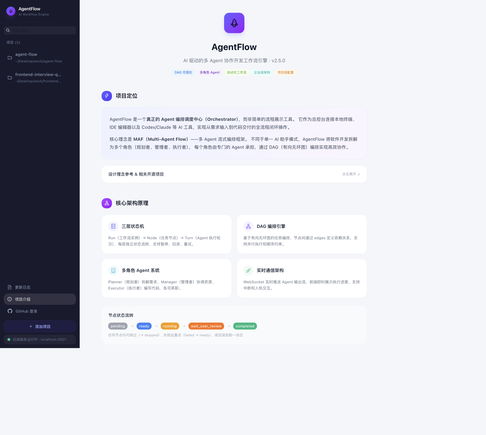
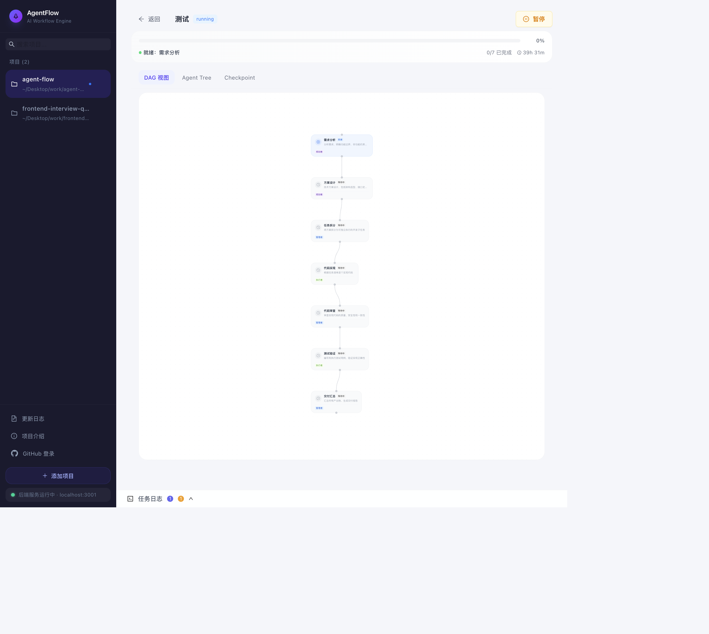
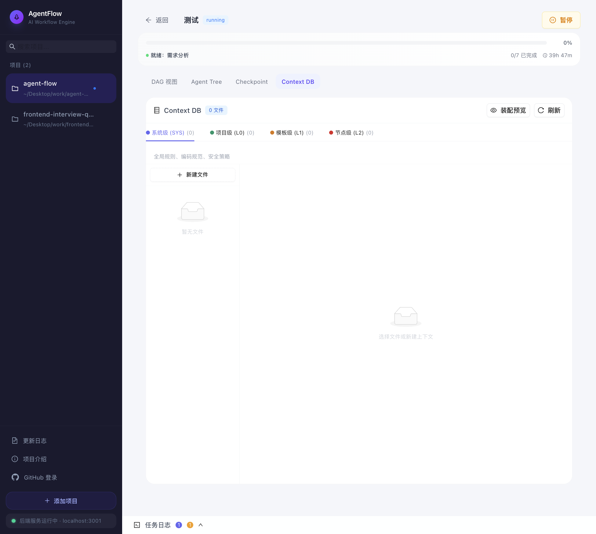
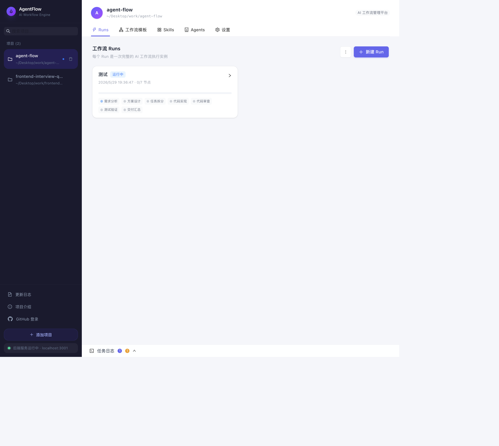
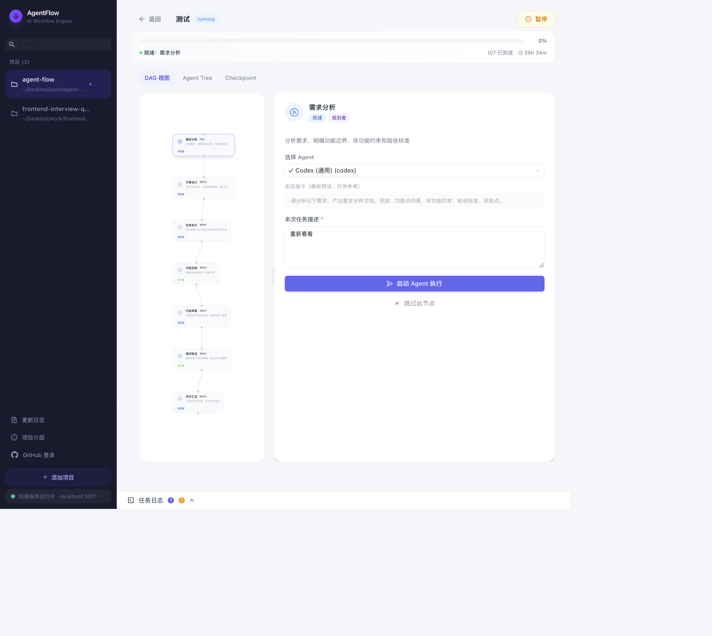
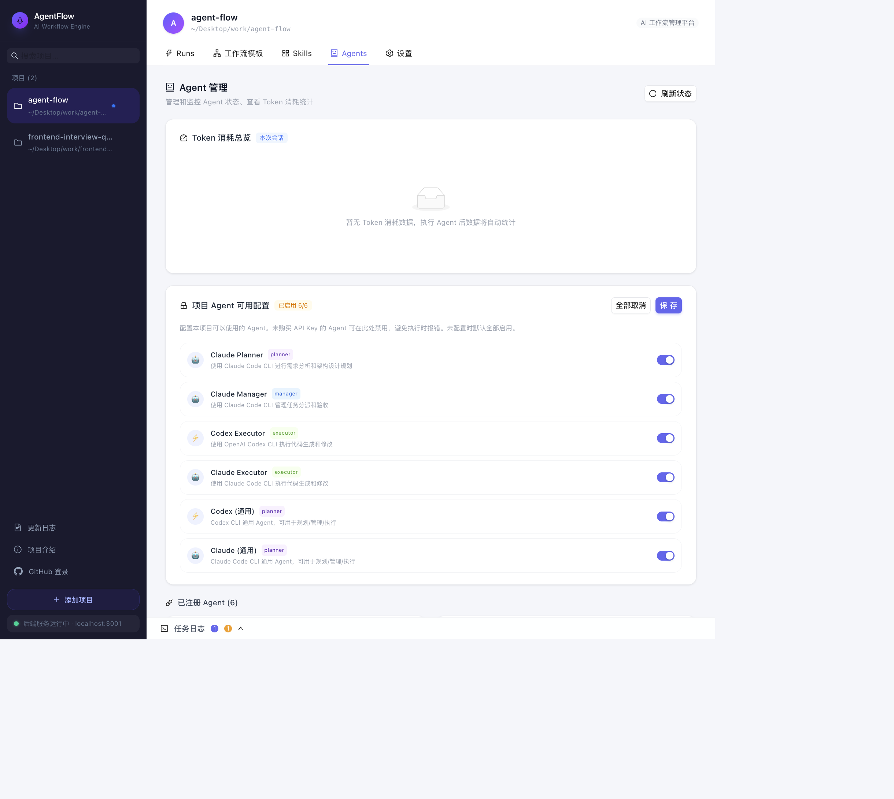
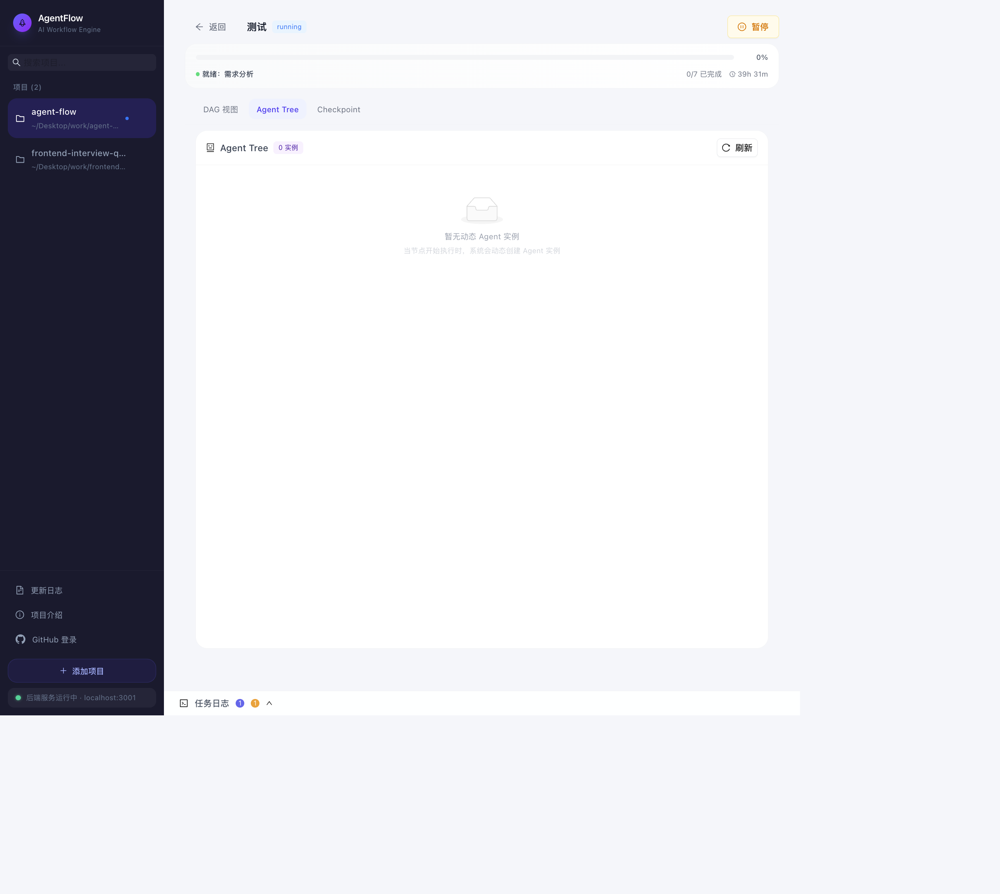
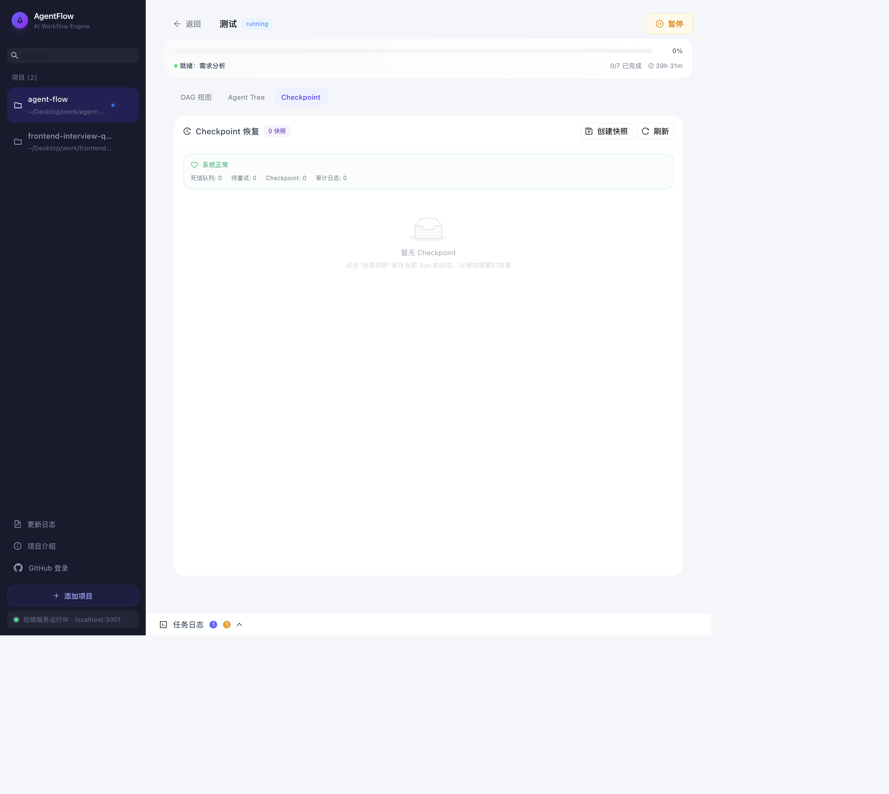
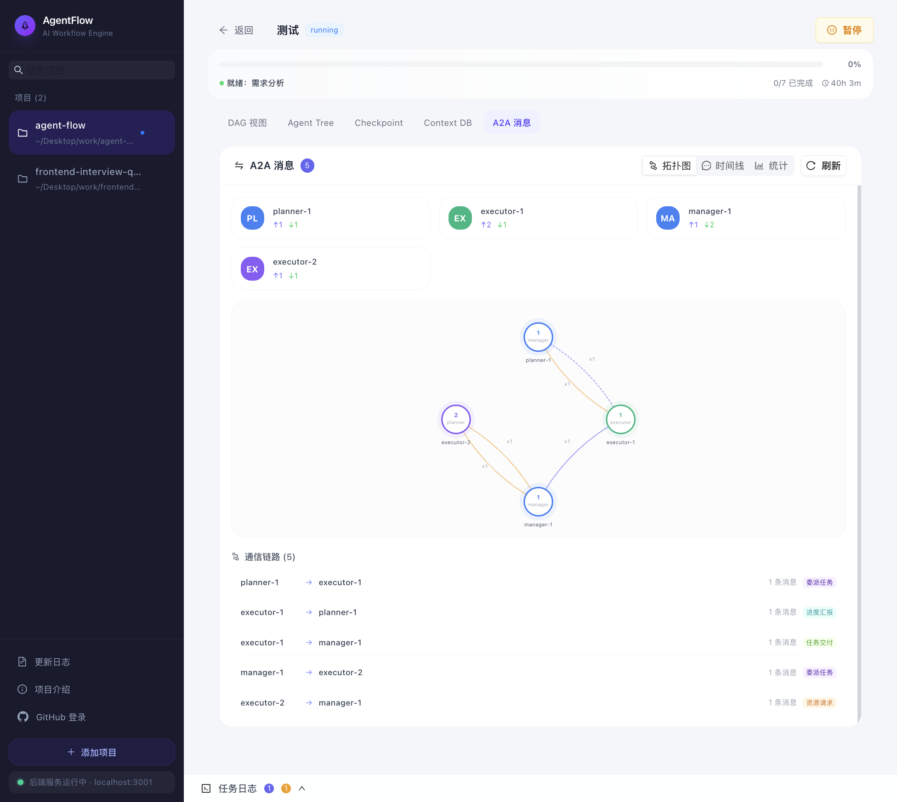

# AgentFlow 使用手册

> 版本：v2.8.7 | 更新日期：2026-06-04  
> 仓库：https://github.com/XiaoPeng1112/agent-flow  
> 在线演示：https://xiaopeng1112.github.io/agent-flow/

---

## 1. 项目简介

AgentFlow 是一个 AI 驱动的多 Agent 协作开发工作流引擎，核心定位为 **Agent 编排调度中心（Orchestrator）**。它连接本地终端、IDE 编辑器以及 Codex/Claude 等 AI 工具，实现从需求输入到代码交付的全流程闭环操作。

核心理念是 **MAF（Multi-Agent Flow）**——将软件开发拆解为多个角色（规划者、管理者、执行者），每个角色由专门的 Agent 承担，通过 DAG（有向无环图）编排实现高效协作。



---

## 2. 环境准备与安装

### 2.1 系统要求

- Node.js 20+（Vite 8 强制要求）
- Git（用于仓库隔离 worktree 功能）
- 推荐使用 nvm 管理 Node 版本

### 2.2 安装步骤

```bash
# 克隆项目
git clone https://github.com/XiaoPeng1112/agent-flow.git
cd agent-flow

# 切换 Node 版本
nvm use 20

# 安装依赖（Monorepo，一次安装前后端所有依赖）
yarn install
```

### 2.3 环境变量配置（可选）

```bash
# GitHub OAuth 登录功能（需到 GitHub 创建 OAuth App）
export GITHUB_CLIENT_ID=your_client_id
export GITHUB_CLIENT_SECRET=your_client_secret

# 文件系统安全白名单（限制 Agent 可访问的目录，逗号分隔）
export ALLOWED_FILE_ROOTS=/path/to/project1,/path/to/project2
```

---

## 3. 启动与运行

### 3.1 开发模式

```bash
yarn dev
```

该命令会同时启动前后端：

| 服务 | 地址 | 说明 |
|------|------|------|
| 前端 | http://localhost:5173/agent-flow/#/ | Vite Dev Server + HMR |
| 后端 API | http://localhost:3001/api | Express REST API |
| WebSocket | ws://localhost:3001/ws | Agent 输出实时推送 |
| 健康检查 | http://localhost:3001/health | 服务状态检测 |

### 3.2 生产构建

```bash
# 构建前端
yarn workspace @agent-flow/client build

# 部署到 GitHub Pages
yarn deploy
```

### 3.3 常见启动问题

**端口被占用**：如果看到 `EADDRINUSE` 错误，执行以下命令清理：

```bash
lsof -ti:3001 -ti:5173 | xargs kill -9
```

**HMR 不生效**：项目已配置 `usePolling` 模式（针对 macOS FSEvents 不触发的情况），如仍不生效，手动刷新浏览器（`Cmd+Shift+R`）。

**Node 版本不对**：Vite 8 需要 Node.js 20+，执行 `nvm use 20` 切换。

---

## 4. 核心概念

### 4.1 三层状态机

AgentFlow 的工作流采用三层嵌套状态机：

```
Run（工作流实例）
  └── Node（任务节点）
       └── Turn（Agent 执行轮次）
```

- **Run**：`created → running → completed / failed`
- **Node**：`pending → ready → running → wait_user_review → completed / skipped / failed`
- **Turn**：`idle → running → completed / error / paused`

### 4.2 DAG 编排

任务节点通过有向无环图（DAG）定义执行顺序。当一个节点的所有前置依赖完成后，自动进入 `ready` 状态。支持条件分支（EdgeCondition）实现动态路由。

v2.5.0 引入了基于 `@xyflow/react` 的 DAG 可视化渲染，节点以卡片形式展示状态、描述和角色信息，边连线动态展示依赖关系。



### 4.3 多角色 Agent

| 角色 | 职责 | 典型工具 |
|------|------|----------|
| Planner | 需求拆解为可执行任务 | Claude CLI |
| Manager | 协调资源、分配节点 | Claude CLI |
| Executor | 调用 CLI 工具编写代码 | Codex CLI |

### 4.4 执行模式（Execution Mode）

v2.5.0 新增了三种执行模式，可在工作流模板的节点定义中指定：

| 模式 | 说明 | 适用场景 |
|------|------|----------|
| `llm` | 传统 LLM Agent 执行（默认） | 需要创造性推理的任务 |
| `det` | 确定性脚本执行（Deterministic） | 有明确脚本可直接运行的任务 |
| `hyb` | 混合模式（脚本优先，失败回退 LLM） | 脚本可能失败需要兜底的任务 |

**DET 模式**直接执行节点模板中定义的 `script` 字段，具有以下特点：5 分钟执行超时、进程自动清理、执行完毕自动标记节点完成，无需 LLM 介入。

**HYB 模式**先尝试以 DET 模式执行脚本，若脚本执行失败（退出码非 0），自动回退到 LLM 模式由 Agent 接手处理。

### 4.5 Context Chaining

节点执行前，引擎自动聚合所有前置节点的产出（Turn 输出 + Artifacts），作为当前节点的输入上下文。无需手动指定信息来源，DAG 拓扑自动决定上下文流向。

### 4.6 Context DB（四层上下文管理）

v2.5.0 引入了层次化上下文数据库，按作用域分为四层：

| 层级 | 标识 | 作用域 | 说明 |
|------|------|--------|------|
| SYS | 系统级 | 全局 | 系统配置、全局规则 |
| L0 | 项目级 | 单项目 | 项目元信息、架构约束 |
| L1 | Run 级 | 单次运行 | 本次运行的上下文累积 |
| L2 | Node 级 | 单节点 | 节点局部上下文 |

Context DB 以文件为载体，支持热加载，Agent 执行时自动注入对应层级的上下文。通过 `context-db.ts` 服务管理。

v2.5.0 提供了前端 Context DB 编辑器面板，可在 Run 详情页的 **Context DB** 标签中直接可视化编辑四层上下文内容，支持新建/编辑/删除上下文文件、层级切换和装配预览。



### 4.7 OutputContracts（产出物合同）

每个模板节点声明应产出什么（category + format + required），节点完成后系统自动校验 Agent 产出物是否满足合同。

### 4.8 Dynamic Agent（动态 Agent 实例）

v2.5.0 的 `dynamic-agent-factory.ts` 支持按角色动态创建 Agent 实例。系统根据节点角色、项目配置和可用 Provider 自动选择并实例化最合适的 Agent，支持运行时动态扩缩。

---

## 5. 使用指南

### 5.1 创建项目

1. 打开浏览器访问 http://localhost:5173/agent-flow/
2. 侧边栏底部点击 **「+ 添加项目」**
3. 输入项目名称和本地路径
4. 项目创建后自动出现在侧边栏列表中

### 5.2 创建并运行工作流

1. 点击项目进入详情页，切换到 **Runs** 标签
2. 点击 **「新建 Run」**，选择工作流模板：
   - **标准 SDD 开发流程**：specify → design → task → implement → review → deliver
   - **快速功能迭代**：specify → implement → test → deliver
   - **Bug 修复流程**：specify → implement → test → deliver
   - **前后端并行开发**：specify → [implement-fe ∥ implement-be] → test → deliver
3. 创建后进入 Run 详情页（DAG 视图）
4. 在第一个 `ready` 节点中填写需求描述
5. 点击 **「启动执行」** 按钮触发 Agent 执行



### 5.3 节点操作

| 操作 | 说明 |
|------|------|
| 启动执行 | 触发 Agent 处理当前节点 |
| 验收通过 | 审核 Agent 产出后标记完成 |
| 打回重做 | 对产出不满意，要求 Agent 重新执行 |
| 跳过节点 | 跳过当前节点，后续节点自动就绪 |
| 取消执行 | 中断正在运行的 Agent 进程 |
| 强制重置 | 将节点状态强制恢复为 `ready` |
| 节点回滚 | 回滚到前一状态 |

点击 DAG 图中的任意节点，可打开节点详情面板，查看节点状态、输入输出、执行历史和产出物：



### 5.4 查看 Skills

进入项目 → **Skills** 标签，查看系统自动扫描发现的 Skills 列表。扫描路径包括：

- 全局：`~/.catpaw/skills`、`~/.claude/skills`、`~/.codex/skills`
- 项目级：`项目目录/.catpaw/skills`、`项目目录/.claude/skills`

### 5.5 配置项目 Agent

进入项目 → **Agents** 标签，在「Agent 管理」面板中：

1. 查看所有可用 Agent 列表（含 Provider 信息）
2. 通过 Switch 开关启用/禁用每个 Agent
3. 点击「保存」持久化配置

保存后，DAG 节点详情中的 Agent 下拉列表将自动过滤，仅展示当前项目已启用的 Agent。这样用户只需关注自己拥有 API Key 的 Provider。



### 5.6 Agent Tree 面板

Run 详情页顶部切换到 **Agent Tree** 标签，可以以树形结构查看当前 Run 的 Agent 实例分布：

- 按角色（Planner / Manager / Executor）分组
- 展示每个 Agent 实例的状态（空闲 / 执行中 / 已完成）
- 支持刷新实时状态



### 5.7 Checkpoint 快照与恢复

Run 详情页顶部切换到 **Checkpoint** 标签，管理工作流快照：

- 查看 Timeline 时间线上的所有快照点
- 支持手动创建快照（记录当前 Run 完整状态）
- 从任意快照点恢复 Run（回退到历史状态）
- 实时健康监控（节点完成率、失败率）



### 5.8 Diff Review 面板（产出物闭环）

Run 详情页顶部切换到 **Diff Review** 标签，可以像 GitHub PR 那样审查 Agent 产出的代码变更：

**文件树视图（左侧）**：展示所有变更文件列表，每个文件显示增加行数（绿色 +N）和删除行数（红色 -N）。点击文件名可在右侧查看详细 diff。

**行级 Diff 视图（右侧）**：以 Hunk 为单位展示代码变更，添加的行为绿色背景，删除的行为红色背景，上下文行为灰色。每个 Hunk 可独立折叠/展开。

**合并模式（v2.8.3+）**：系统根据项目的合并模式（mergeMode）展示不同的操作界面：

- **本地模式（local）**：适用于个人项目，审查完成后选择合并策略直接合入本地 master 分支。
- **PR 模式（pr）**：适用于团队项目，点击“创建 PR”按钮将代码推送到特性分支并自动创建 GitHub Pull Request，成功后展示 PR 链接。

**本地模式合并策略**：

| 策略 | 说明 |
|------|------|
| Squash | 压缩所有变更为单次提交（推荐） |
| Merge Commit | 保留完整提交历史并创建合并提交 |
| Rebase | 变基到目标分支（线性历史） |

**操作按钮**：
- **Approve**（本地模式）：按选定策略合并代码变更到主分支
- **创建 PR**（PR 模式）：推送特性分支并创建 GitHub Pull Request
- **Discard**：丢弃全部变更，清理 worktree 并删除分支


### 5.9 Metrics 面板（可观测性）

Run 详情页顶部切换到 **Metrics** 标签，可查看当前 Run 的全链路运行指标。面板提供四个子视图：

**Overview（概览）**：6 张指标卡片展示 Run 核心数据：
- 总耗时（从第一个节点启动到最后一个节点完成）
- 总 Token 消耗（所有节点累计）
- 平均节点耗时
- 首次通过率（一次审批即通过的节点占比）
- 打回率（被打回重做的节点占比）
- 效率评分（综合加权得分）0-100）

**Timeline（时间线）**：Gantt 甘特图展示各节点执行时间跨度。水平条形图表示每个节点的开始-结束时间，可直观看到哪些节点是并行执行的。

**Token Distribution（Token 分布）**：水平柱状图展示各节点/Agent 的 Token 消耗占比，快速识别 Token 消耗大户。

**Efficiency（效率评分）**：可排序表格展示每个节点的效率评分（综合考虑执行时间、Token 消耗和质量指标），配合进度条可视化，方便快速定位低效节点。


### 5.10 A2A 消息面板

Run 详情页顶部切换到 **A2A 消息** 标签，可视化展示当前 Run 中所有 Agent 之间的消息流转情况。面板提供三种视图模式：

**拓扑图视图（默认）**：以 SVG 网络图形式呈现 Agent 间通信关系。每个 Agent 显示为带角色标识的圆形节点（不同角色颜色区分：Planner 蓝色、Executor 绿色、Manager 紫色），节点之间的连线表示消息通道，线条粗细和标注数字反映消息数量。上方卡片区显示每个 Agent 的发送/接收消息统计，下方列出所有通信链路及其消息类型标签（委派任务、进度汇报、任务交付、资源请求等）。

**时间线视图**：以时间顺序展示所有 A2A 消息列表。每条消息显示发送方、接收方、消息类型、优先级和时间戳，支持按消息类型（request / response / notify / delegate / report）和优先级筛选。点击消息卡片可展开查看完整 payload 内容。

**统计视图**：展示 A2A 通信的量化指标，包括总消息数、活跃 Agent 数、平均响应时间、通道数等统计卡片，以及消息类型分布柱状图、优先级分布饼图和各 Agent 活跃度排行。

面板右上角提供「刷新」按钮手动拉取最新消息数据。



### 5.11 节点 Skill 绑定（v2.8.5）

在 Run 详情页中，点击任意节点打开详情面板，可以为节点绑定 Skills：

- **Skill 选择器**：Select 多选下拉框，支持搜索过滤可用 Skills
- **绑定操作**：选择 Skill 后自动保存（乐观更新），失败时自动回滚
- **生效方式**：Agent 执行时，绑定的 Skill 文件内容会被物化并注入到 prompt 的第 5.5 层（前驱产出物之后、节点指令之前）
- **动态更新**：通过 `PATCH /api/runs/:runId/nodes/:nodeId/skills` 可随时修改绑定

### 5.12 Skill 自动沉淀（v2.8.6）

当节点执行完成后，系统自动评估产出物价值。高价值内容会被自动沉淀为可复用 Skill 文件：

- **自动沉淀**：无需手动操作，系统通过 5 维评分引擎自动判断（阈值 0.6）
- **手动沉淀**：进入项目 → Skills 标签 → 选择节点产出 → 点击"提取为 Skill"
- **去重保护**：Jaccard 相似度检测，相似度 > 0.7 自动跳过，避免重复 Skill
- **存储位置**：`项目目录/.agent-flow/skills/<skill-name>/SKILL.md`

查看沉淀记录：`GET /api/skills/extraction-log`

### 5.13 产出物预览（v2.8.7）

节点执行完成后，产出物（Artifacts）在节点详情面板中按类别差异化展示：

| 类别 | 颜色 | 展示方式 |
|------|------|----------|
| code | 蓝色 | 语法高亮（SyntaxHighlighter） |
| document | 绿色 | 文本预览 + 折叠 |
| test | 紫色 | 测试用例高亮 |
| report | 橙色 | 报告摘要 |
| config | 灰色 | JSON/YAML 高亮 |

每个产出物卡片支持展开/折叠内容预览，帮助用户快速审查 Agent 产出质量。

### 5.14 GitHub 登录

侧边栏底部用户面板 → 点击 **「登录」** → 跳转 GitHub 授权 → 授权后自动返回并显示用户信息。

---

## 6. REST API 参考

所有 API 基础路径为 `http://localhost:3001/api`，响应格式统一为：

```json
{ "success": true, "data": { ... } }
{ "success": false, "error": "错误信息" }
```

### 6.1 项目管理

| 方法 | 路径 | 说明 |
|------|------|------|
| GET | `/projects` | 获取所有项目列表 |
| POST | `/projects` | 创建项目 |
| PUT | `/projects/:id` | 更新项目（支持 enabledAgentIds） |
| DELETE | `/projects/:id` | 删除项目 |
| GET | `/projects/:id/enabled-agents` | 获取项目已启用的 Agent 列表 |
| PUT | `/projects/:id/enabled-agents` | 更新项目 Agent 启用配置 |

请求示例：

```json
PUT /api/projects/proj-001/enabled-agents
{
  "enabledAgentIds": ["codex-planner", "claude-executor", "claude-reviewer"]
}
// → { "success": true, "data": { "enabledAgentIds": [...] } }
```

当 `enabledAgentIds` 为 `undefined` 或未设置时，表示所有 Agent 均可用（向后兼容）。

### 6.2 工作流模板

| 方法 | 路径 | 说明 |
|------|------|------|
| GET | `/templates` | 获取所有模板 |
| GET | `/templates/:id` | 获取模板详情 |
| POST | `/templates` | 创建自定义模板 |

### 6.3 Run 管理

| 方法 | 路径 | 说明 |
|------|------|------|
| GET | `/runs` | 获取所有 Run |
| POST | `/runs` | 创建 Run（需指定 templateId + projectId） |
| GET | `/runs/:id` | 获取 Run 详情（含所有节点和 Turn） |
| DELETE | `/runs/:id` | 删除 Run |
| POST | `/runs/:id/start` | 启动 Run |

### 6.4 节点操作

| 方法 | 路径 | 说明 |
|------|------|------|
| POST | `/runs/:runId/nodes/:nodeId/start` | 启动节点 |
| POST | `/runs/:runId/nodes/:nodeId/approve` | 验收通过 |
| POST | `/runs/:runId/nodes/:nodeId/reject` | 打回重做 |
| POST | `/runs/:runId/nodes/:nodeId/skip` | 跳过节点 |
| POST | `/runs/:runId/nodes/:nodeId/reset` | 强制重置 |
| POST | `/runs/:runId/nodes/:nodeId/rollback` | 回滚 |

### 6.5 Agent 执行

| 方法 | 路径 | 说明 |
|------|------|------|
| POST | `/runs/:runId/nodes/:nodeId/execute` | 启动 Agent 执行节点（支持 executionMode 参数） |
| POST | `/runs/:runId/auto-execute` | 批量启动所有 ready 节点 |
| POST | `/turns/:turnId/cancel` | 取消正在执行的 Turn |

`execute` 接口支持 `executionMode` 参数，可选值为 `"llm"`（默认）、`"det"`、`"hyb"`。DET 模式下会直接调用 `AgentService.executeDET()` 执行节点模板中的脚本。

### 6.6 Repo Isolation（仓库隔离）

| 方法 | 路径 | 说明 |
|------|------|------|
| POST | `/repo-pool/workspace` | 创建隔离工作空间 |
| GET | `/repo-pool/status` | 获取仓库池状态 |
| DELETE | `/repo-pool/workspace/:workspaceId` | 释放工作空间 |

请求示例：

```json
POST /api/repo-pool/workspace
{
  "repoUrl": "https://github.com/user/project.git",
  "runId": "run-001",
  "strategy": "worktree"  // worktree | symlink | copy
}
```

### 6.7 Skill Materialization（Skill 物化）

| 方法 | 路径 | 说明 |
|------|------|------|
| GET | `/skills/materialize/:nodeId` | 获取节点的物化 Skill + Prompt |
| POST | `/skills/whitelist/:nodeId` | 设置节点 Skill 白名单 |
| GET | `/skills/whitelist/:nodeId` | 获取节点 Skill 白名单 |
| GET | `/skills/materialization-stats` | 获取物化统计 |

请求示例：

```json
POST /api/skills/whitelist/node-implement
{
  "allowedSkillIds": ["pdf", "xlsx", "browser"],
  "denySkillIds": ["skill-creator"]
}
```

### 6.8 Permission Isolation（权限隔离）

| 方法 | 路径 | 说明 |
|------|------|------|
| POST | `/permissions/policy` | 设置 Agent 权限策略 |
| GET | `/permissions/policy/:agentId/:runId` | 获取权限策略 |
| POST | `/permissions/check` | 权限检查 |
| GET | `/permissions/audit-log` | 获取审计日志 |

请求示例：

```json
POST /api/permissions/policy
{
  "agentId": "executor-1",
  "runId": "run-001",
  "repoAccess": ["project-*"],
  "filePatterns": {
    "allow": ["src/**/*.ts", "tests/**"],
    "deny": ["src/secrets/**"],
    "permissions": "read,write"
  }
}
```

```json
POST /api/permissions/check
{
  "agentId": "executor-1",
  "runId": "run-001",
  "resource": "src/components/App.tsx",
  "action": "write"
}
// → { "success": true, "data": { "allowed": true, "reason": "matched rule: src/**/*.ts" } }
```

### 6.9 A2A Protocol（Agent 间通信）

| 方法 | 路径 | 说明 |
|------|------|------|
| POST | `/a2a/send` | 发送消息 |
| POST | `/a2a/delegate` | 委派任务 |
| GET | `/a2a/inbox/:agentId` | 获取收件箱 |
| POST | `/a2a/pull/:agentId` | 拉取下一条待处理消息 |
| POST | `/a2a/ack/:messageId` | 确认消息已读 |
| POST | `/a2a/resolve/:messageId` | 解决/完成消息 |
| GET | `/a2a/stats` | 获取通信统计 |
| POST | `/a2a/channels` | 创建通信通道 |
| GET | `/a2a/messages/:runId` | 获取 Run 的所有消息 |

请求示例：

```json
POST /api/a2a/send
{
  "fromAgentId": "planner-1",
  "toAgentId": "executor-1",
  "runId": "run-001",
  "nodeId": "node-implement",
  "type": "request",
  "payload": { "task": "实现用户登录模块" },
  "priority": "high",
  "requiresAck": true
}
```

```json
POST /api/a2a/delegate
{
  "fromAgentId": "manager-1",
  "toAgentId": "executor-2",
  "runId": "run-001",
  "nodeId": "node-test",
  "task": { "description": "编写单元测试", "scope": "src/auth/**" },
  "priority": "normal"
}
```

### 6.10 Contract Validation（合同验证）

| 方法 | 路径 | 说明 |
|------|------|------|
| POST | `/runs/:runId/nodes/:nodeId/validate-contracts` | 验证节点产出物 |

响应示例：

```json
{
  "success": true,
  "data": {
    "result": {
      "nodeId": "node-implement",
      "passed": true,
      "matched": [
        { "contractId": "c1", "artifactId": "a1", "score": 1.0 }
      ],
      "missing": [],
      "extra": ["a2"]
    },
    "report": "✅ 合同验证通过：3/3 必需产出物已满足"
  }
}
```

### 6.11 Robustness（健壮性）

| 方法 | 路径 | 说明 |
|------|------|------|
| GET | `/robustness/health` | 系统健康状态 |
| GET | `/robustness/dead-letter` | 获取死信队列 |
| POST | `/robustness/dead-letter/:itemId/resolve` | 解决死信项 |
| GET | `/robustness/checkpoints/:runId` | 获取 Checkpoint 列表 |
| POST | `/robustness/checkpoints/:runId` | 创建 Checkpoint 快照 |
| GET | `/robustness/audit-log` | 查询审计日志 |

请求示例：

```json
POST /api/robustness/checkpoints/run-001
{
  "description": "implement 节点执行前快照"
}
```

### 6.12 Diff Review（产出物闭环）

| 方法 | 路径 | 说明 |
|------|------|------|
| GET | `/diff-review/:runId` | 获取 Run 的 Diff Review 数据（结构化 FileDiff[]） |
| POST | `/diff-review/:runId/merge` | 执行合并（body: { strategy: 'squash' \| 'merge' \| 'rebase' }） |
| POST | `/diff-review/:runId/discard` | 丢弃分支（清理 worktree + 删除分支） |
| GET | `/diff-review/:runId/file-diff` | 获取单文件 diff（query: filePath） |
| POST | `/artifacts/create-pr/:runId/:nodeId` | 创建 GitHub PR（PR 模式） |
| GET | `/artifacts/pr-status/:owner/:repo/:prNumber` | 查询 PR 状态 |
| GET | `/artifacts/merge-mode/:projectId` | 获取项目合并模式 |
| GET | `/artifacts/detect-repo-type/:projectId` | 检测仓库类型（团队/个人） |
| POST | `/artifacts/detect-and-set-merge-mode/:projectId` | 检测并自动设置合并模式 |

请求示例：

```json
POST /api/diff-review/run-001/merge
{
  "strategy": "squash"
}
// → { "success": true, "data": { "message": "Branch merged successfully", "strategy": "squash" } }
```

### 6.13 Metrics（可观测性）

| 方法 | 路径 | 说明 |
|------|------|------|
| GET | `/metrics/:runId` | 获取 Run 完整运行指标 |
| GET | `/metrics/:runId/token-distribution` | 获取 Token 分布数据 |
| GET | `/metrics/:runId/efficiency` | 获取各节点效率评分 |
| GET | `/metrics/:runId/trend` | 获取趋势数据（多 Run 对比） |

响应示例：

```json
GET /api/metrics/run-001
{
  "success": true,
  "data": {
    "totalDuration": 3600000,
    "totalTokens": 125000,
    "nodeCount": 6,
    "completedNodes": 5,
    "rejectedNodes": 1,
    "firstPassRate": 0.83,
    "rejectRate": 0.17,
    "efficiencyScore": 72
  }
}
```

### 6.14 Dynamic Agent（动态 Agent）

| 方法 | 路径 | 说明 |
|------|------|------|
| GET | `/agents` | 获取所有已注册 Agent |
| GET | `/agents/instances/:runId` | 获取 Run 的动态 Agent 实例树 |
| POST | `/agents/spawn` | 手动触发 Agent 实例创建 |

Dynamic Agent Factory 根据节点角色和项目 Agent 配置自动实例化 Agent，无需手动管理。通过 Agent Tree 面板可查看当前 Run 所有活跃实例。

### 6.15 Context DB

| 方法 | 路径 | 说明 |
|------|------|------|
| GET | `/context/:level` | 获取指定层级上下文（sys/l0/l1/l2） |
| PUT | `/context/:level` | 更新指定层级上下文 |
| GET | `/context/merged/:nodeId` | 获取节点合并后的完整上下文 |

Context DB 自动管理四层上下文文件，Agent 执行时注入合并后的上下文。

### 6.16 Skill Extraction（Skill 自动沉淀）

| 方法 | 路径 | 说明 |
|------|------|------|
| GET | `/skills/extraction-stats` | 获取沉淀统计数据 |
| GET | `/skills/extraction-log` | 获取沉淀历史日志 |
| POST | `/skills/extract` | 手动触发 Skill 提取 |
| GET | `/skills/project-dir/:projectId` | 获取项目 Skill 目录 |
| PATCH | `/runs/:runId/nodes/:nodeId/skills` | 更新节点 Skill 绑定 |

请求示例：

```json
POST /api/skills/extract
{
  "nodeId": "node-implement",
  "runId": "run-001",
  "force": true
}
// → { "success": true, "data": { "skillName": "user-auth-implementation", "confidence": 1.0, "path": "..." } }
```

### 6.17 其他 API

| 方法 | 路径 | 说明 |
|------|------|------|
| GET | `/skills` | 获取所有 Skills |
| POST | `/skills/recommend` | 智能推荐 Skills |
| GET | `/git/status/:projectId` | 获取 Git 状态 |
| GET | `/git/commits/:projectId` | 获取 commit 列表 |
| GET | `/git/diff/:projectId` | 获取 diff |
| GET | `/auth/github` | GitHub OAuth 授权地址 |
| GET | `/auth/status` | 当前登录状态 |
| POST | `/auth/logout` | 退出登录 |
| GET | `/health` | 健康检查 |

---

## 7. WebSocket 事件

连接地址：`ws://localhost:3001/ws`

### 7.1 服务端推送事件

| 事件类型 | 说明 |
|----------|------|
| `turn_output` | Agent 实时输出流（逐 chunk 推送） |
| `turn_completed` | Agent 执行完成（含 token 统计） |
| `turn_error` | Agent 执行出错 |
| `node_status_changed` | 节点状态变更 |
| `run_status_changed` | Run 状态变更 |
| `det_execution_start` | DET 模式脚本执行开始 |
| `det_execution_complete` | DET 模式脚本执行完成 |
| `checkpoint_created` | 新 Checkpoint 快照已创建 |

### 7.2 消息格式

```json
{
  "type": "turn_output",
  "data": {
    "turnId": "turn-xxx",
    "nodeId": "node-implement",
    "runId": "run-001",
    "content": "正在分析需求..."
  }
}
```

---

## 8. 数据存储

当前版本使用 SQLite + WAL 作为本地核心持久化层，辅以少量 JSON 配置文件和上下文目录：

| 文件路径 | 内容 |
|----------|------|
| `~/.agent-flow/data/agent-flow.db` | 项目、模板、Run、节点、Turn、Artifact 等核心数据 |
| `~/.agent-flow/auth.json` | OAuth 认证信息 |
| `~/.agent-flow/context/` | Context DB 四层上下文文件 |
| `~/.agent-flow/checkpoints/` | Checkpoint 快照数据 |
| `~/.agent-flow/metrics/metrics.json` | 运行指标持久化数据 |

---

## 9. 项目结构

```
agent-flow/
├── packages/
│   ├── client/              # 前端 React 19 + Vite 8 + Tailwind v4
│   │   └── src/
│   │       ├── api/         # REST API 客户端封装
│   │       ├── components/  # UI 组件（detail/ layout/ sidebar/）
│   │       │   └── detail/  # DAG 视图、AgentTree、Checkpoint、ContextDB、A2A 面板
│   │       ├── pages/       # 路由页面（About、Changelog 等）
│   │       ├── store/       # Zustand 状态管理
│   │       └── types/       # TypeScript 类型
│   └── server/              # 后端 Express 5 + WebSocket
│       └── src/
│           ├── index.ts             # 服务入口
│           ├── routes/api.ts        # REST API 路由（12 个子路由文件）
│           ├── services/            # 业务服务层（24 个模块）
│           │   ├── agent.ts         # Agent 执行（含 DET/HYB 模式）
│           │   ├── dynamic-agent-factory.ts  # 动态 Agent 实例工厂
│           │   ├── context-db.ts    # 四层上下文管理
│           │   ├── robustness.ts    # Checkpoint + 健壮性
│           │   ├── skill-materialization.ts  # [v2.8.5] Skill 物化 + Prompt 注入
│           │   ├── skill-extraction.ts      # [v2.8.6] Skill 自动沉淀
│           │   └── ...              # 其他服务
│           └── types/index.ts       # 核心类型定义
├── docs/                    # 文档（本手册 + 截图）
├── .agent-flow/context/     # 项目上下文文档
└── scripts/                 # 工具脚本
```

---

## 10. 部署指南

### 10.1 GitHub Pages 部署

```bash
# 一键构建 + 部署
yarn deploy
```

该命令执行：
1. 构建前端（`tsc -b && vite build`）
2. 拷贝静态 `404.html` 到产物目录（GitHub Pages 兜底页面）
3. 通过 gh-pages 推送 `dist/` 到 GitHub Pages

部署后访问：https://xiaopeng1112.github.io/agent-flow/

当前前端使用 `HashRouter`，线上深链接形态为 `https://xiaopeng1112.github.io/agent-flow/#/projects/{projectId}/runs/{runId}`，可避免 GitHub Pages 对 History 路径的额外 404 请求。

### 10.2 架构说明

AgentFlow 采用**前端部署 + 本地后端**架构：

- 前端可部署在任何静态托管服务（GitHub Pages、Vercel、Netlify）
- 后端必须在用户本机运行（需访问本地文件系统和 CLI 工具）
- 浏览器中的前端直接连接 `localhost:3001`

因此，即使通过 GitHub Pages 访问前端，也需要在本地启动后端服务：

```bash
cd agent-flow && nvm use 20 && yarn dev
```

---

## 11. 安全机制

| 机制 | 说明 |
|------|------|
| 文件系统白名单 | `ALLOWED_FILE_ROOTS` 限制可访问目录，路径穿越防护 |
| OAuth CSRF 防护 | state 参数随机值 + 10 分钟 TTL |
| WebSocket 防泄漏 | ManagedWS dispose 标志位防止递归重连 |
| Agent 取消安全 | cancelledTurns Set 防止 close handler 重复提交 |
| 权限隔离 | RBAC deny-by-default + glob 文件访问规则 |
| 仓库隔离 | Git worktree 池化防止并行 Run 文件冲突 |
| 数据持久化 | 所有状态变更 async/await persist() |
| 启动恢复 | 自动重置孤儿 running 节点 |
| DET 进程沙箱 | 5 分钟超时 + 进程组自动 kill |

---

## 12. 开发指南

### 12.1 添加新的服务模块

1. 在 `packages/server/src/services/` 创建服务文件
2. 在 `packages/server/src/types/index.ts` 添加相关类型
3. 在 `packages/server/src/index.ts` 实例化服务并注入依赖
4. 在 `packages/server/src/routes/api.ts` 的 `createApiRouter` 中添加 API 路由
5. 运行 `npx tsc --noEmit` 确认编译通过

### 12.2 添加新的前端页面

1. 在 `packages/client/src/pages/` 创建页面组件
2. 在 `packages/client/src/router/` 添加路由配置
3. 如需后端交互，在 `packages/client/src/api/` 添加 API 方法

### 12.3 调试技巧

```bash
# 仅启动后端（带 watch 热更新）
yarn dev:server

# 仅启动前端
yarn dev:client

# TypeScript 类型检查
cd packages/server && npx tsc --noEmit
cd packages/client && npx tsc --noEmit
```

### 12.4 运行测试

```bash
# 运行全部单元测试（需要 Node 20+）
cd packages/server && yarn test

# Watch 模式（文件变更自动重跑）
yarn test:watch

# 生成覆盖率报告
yarn test:coverage
```

---

## 13. 故障排查

| 问题 | 原因 | 解决方案 |
|------|------|----------|
| 红色"后端服务未连接"横幅 | 后端未启动 | 执行 `yarn dev` |
| 前端显示空白 | Node.js 版本过低 | `nvm use 20` |
| EADDRINUSE 端口冲突 | 旧进程未退出 | `lsof -ti:3001 \| xargs kill -9` |
| HMR 不生效 | FSEvents 不触发 | 已配置 usePolling，硬刷新 `Cmd+Shift+R` |
| Agent 执行无响应 | codex-cli/claude-cli 未安装 | 安装对应 CLI 工具 |
| GitHub 登录报错 | 未配置 OAuth 环境变量 | 设置 `GITHUB_CLIENT_ID` 和 `GITHUB_CLIENT_SECRET` |
| 构建 vendor chunk 过大警告 | antd 体积较大 | 可忽略，页面已通过 React.lazy 独立拆分 |
| Vitest 报错 styleText | Node.js 版本过低 | 需要 Node 20+，`nvm use 20` |
| DET 脚本超时 | 脚本执行超过 5 分钟 | 优化脚本或改用 HYB 模式 |

---

## 14. 版本历史

| 版本 | 日期 | 重点 |
|------|------|------|
| v2.8.7 | 2026-06-04 | 产出物体系全链路优化（格式引导 + 4 级解析 + 5 类分类展示 + 5 大联动点） |
| v2.8.6 | 2026-06-04 | Skill 自动沉淀系统（5 维评分引擎 + Jaccard 去重 + 事件驱动持久化） |
| v2.8.5 | 2026-06-04 | Skill 物化执行链路正式接入（DynamicAgentFactory Step 5.5 注入 + NodeSkillBinding UI） |
| v2.8.4 | 2026-06-04 | 基础代码清理与结构优化 |
| v2.8.3 | 2026-06-03 | GitHub PR 工作流 + 仓库类型自动检测 + 团队项目强制 PR 模式 |
| v2.8.2 | 2026-06-03 | 同步删除修复 + Metrics/DiffReview API 路径修正 |
| v2.8.1 | 2026-06-02 | Run 删除持久化修复 + SQLite 显式清理补强 + 文档版本口径对齐 |
| v2.8.0 | 2026-06-02 | Context DB 四层体系闭环 + 模板声明式重构 + 项目 Settings 增强 + DAG 准入准出引擎 |
| v2.7.3 | 2026-06-02 | SQLite+WAL 持久化迁移 + WorkflowEngine Facade 拆分 + 路由模块化 |
| v2.7.2 | 2026-06-01 | 多用户数据隔离 + 跨设备 gitRemote 自动匹配 |
| v2.7.1 | 2026-06-01 | GitHub Private Repo 数据同步 + Context DB 多设备同步 |
| v2.7.0 | 2026-05-31 | 反馈闭环（FeedbackCollector + WeeklyDigest）+ 轻量迭代机制 |
| v2.6.0 | 2026-05-31 | 产出物闭环（Diff Review + Merge/Discard）+ 可观测性增强（Metrics 指标采集 + 可视化） |
| v2.5.0 | 2026-05-31 | DAG 可视化 + DET/HYB 执行模式 + Dynamic Agent + Context DB + Agent Tree + Checkpoint UI + Per-Project Agent 配置 + A2A 消息面板 |
| v2.4.3 | 2026-05-31 | Markdown 渲染 + Overview 面板 + ChangelogPage 增强 |
| v2.4.2 | 2026-05-31 | DAG 视图基础实现（@xyflow/react） |
| v2.4.1 | 2026-05-30 | 工程质量提升（代码分割 / ErrorBoundary / useRequest / Vitest） |
| v2.4.0 | 2026-05-30 | MAF 六大服务模块（Repo/Skill/Permission/A2A/Contract/Robustness） |
| v2.3.1 | 2026-05-30 | 模板补全 + 异步安全修复 |
| v2.3.0 | 2026-05-30 | 安全加固 + DAG 增强 + AI 开发流程优化 |
| v2.2.0 | 2026-05-29 | 后端状态监测 + GitHub Pages 部署 |
| v2.1.0 | 2026-05-29 | 企业级路由 + GitHub OAuth |
| v2.0.0 | 2026-05-29 | MAF 工作流引擎 MVP |
| v1.0.0 | 2026-05-29 | 项目初始化 |

---

## 15. 建议与后续规划

基于当前项目状态，以下是软件工程角度的优化建议：

### 已完成（v2.6.0）

- ✅ **产出物闭环**：Git worktree Diff Review + Squash/Merge/Rebase 合并策略
- ✅ **可观测性增强**：全链路指标采集 + 多维度可视化仪表盘
- ✅ **Per-Project Agent 配置**：项目级 Agent 启用/禁用，DAG 节点自动过滤
- ✅ **DAG 可视化**：基于 @xyflow/react 的节点图形渲染，边连线动态展示
- ✅ **DET/HYB 执行模式**：确定性脚本执行 + 混合模式兜底
- ✅ **Dynamic Agent**：按角色动态创建 Agent 实例
- ✅ **Context DB**：SYS/L0/L1/L2 四层上下文管理
- ✅ **Agent Tree**：树形可视化 Agent 实例分布
- ✅ **Checkpoint UI**：Timeline 快照 + 恢复 + 健康监控
- ✅ **Context DB 编辑器**：前端可视化编辑四层上下文，支持 CRUD + 装配预览
- ✅ **A2A 消息面板**：拓扑图 + 时间线 + 统计三视图，全面展示 Agent 间消息流转
- ✅ **数据持久化**：SQLite + WAL 本地存储，启动时自动从 JSON 平滑迁移
- ✅ **代码分割**：React.lazy + Suspense 路由级分割
- ✅ **单元测试**：Vitest 128 cases 覆盖核心服务
- ✅ **错误边界**：React ErrorBoundary 全局错误隔离
- ✅ **Skill 物化执行链**（v2.8.5）：Skill 内容真正注入 Agent prompt 参与推理
- ✅ **Skill 自动沉淀**（v2.8.6）：5 维评分引擎 + Jaccard 去重 + 事件驱动
- ✅ **产出物体系优化**（v2.8.7）：格式引导 + 4 级解析 + 分类展示 + 5 大联动点

### 长期规划

- **多人协作**：WebSocket 多客户端同步 + 乐观更新 + 冲突解决
- **插件体系**：支持自定义 Agent 类型和节点类型
- **Docker 容器化**：标准化开发和部署环境
- **E2E 测试**：Playwright 覆盖核心用户路径

---

## 许可证

MIT License - 详见 [LICENSE](../LICENSE)
